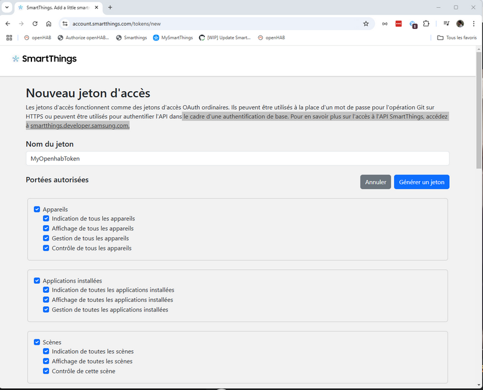
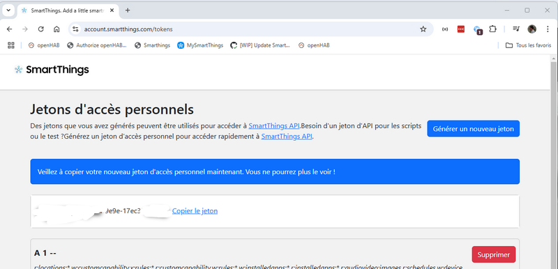
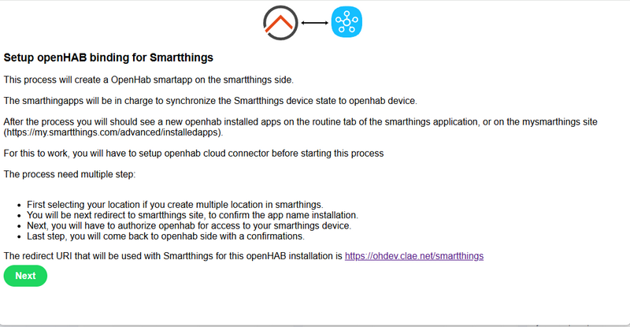
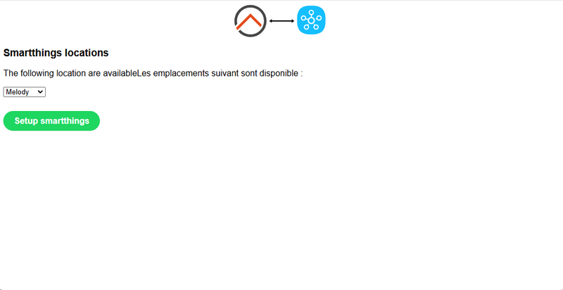
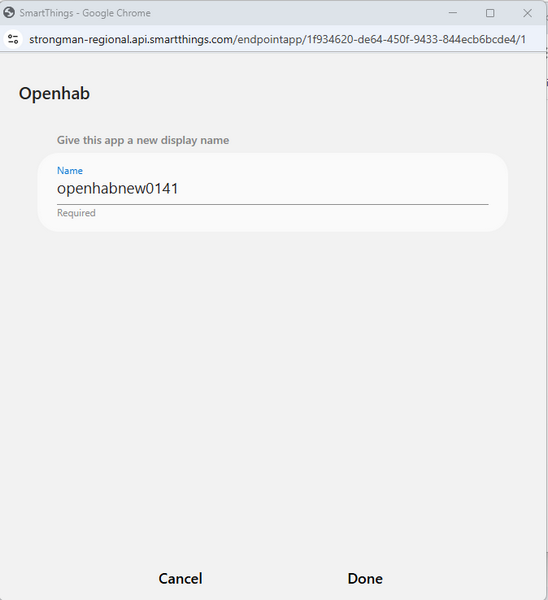
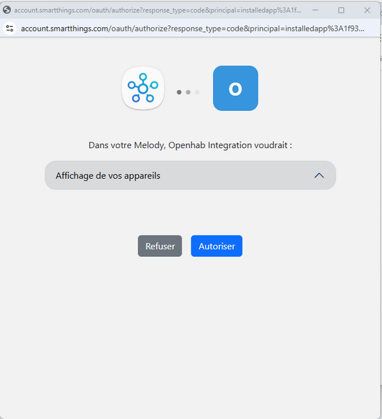
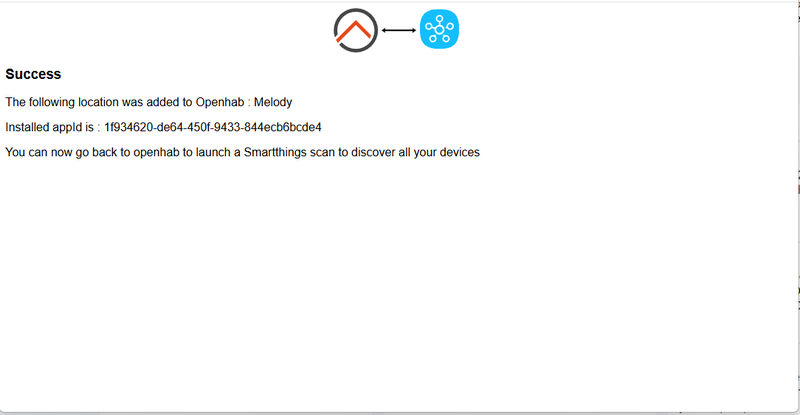
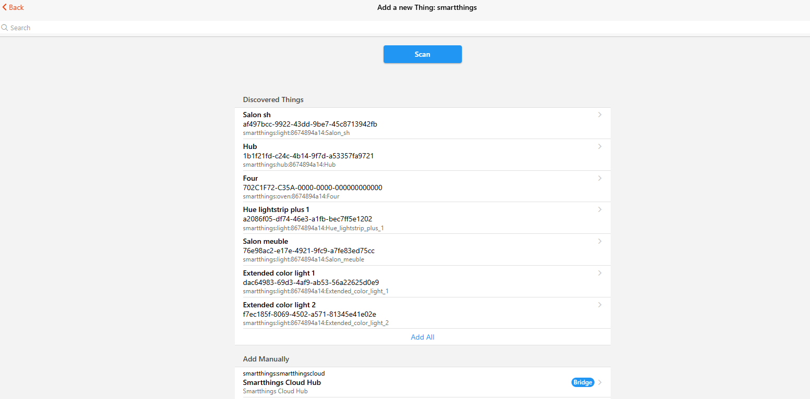

# Samsung Smartthings Binding

This binding integrates the Samsung Smartthings Hub into openHAB.

## Supported things

This binding supports most of the Smartthings devices that are defined in the [Smartthings Capabilities list](https://developer-preview.smartthings.com/docs/devices/capabilities/capabilities-reference/). 

If you find a device that doesn't work [follow these instructions](doc/Troubleshooting.md) to collect the required data so it can be added in a future release.

## Discovery

Discovery allows openHAB to examine a binding and automatically find the Things available on that binding.
Discovery is supported by the Smartthings binding and is run automatically on startup.

## Smartthings Configuration

**The binding will not work until this part has been completed, do not skip this part of the setup.**

You will need an external callback public uri to access your openhab.
This is because Smartthings will push device events directly to openhab.

You will need to get a token before setup the binding.

- For this, go to the following ULR : https://account.smartthings.com/tokens/new


- Then login with you smartthings account / password.


- On the next page, give a token name (arbitrary), select all the Oauth scope.

  


- On the last page, the token will be displayed. 

  

- Make a copy of this token, and fill it on the openhab Smarthings Cloud Hub device.

- Then, go back to openhab things.
  Modify the openhab "Smartthings Cloud Hub" things to add the token to the configuration.
  
- After this, go to the following URL :
    http[s]://myopenhab.domain.com/smartthings/ 

    Verify that the callback uri is ok, and then click Next.

      

- On the next page, select your location, and then click on Setup Smartthings.
  A new window will popup.
      

- In this popup, the name of the application will be display.
  Just confirm by clicking the "Done" button.

      

- Next page is about giving authorization to openhab to access your device.
  Just click the "Authorize" button.

      

- After a few second, the popup will be closed, and you should see this confirmation page.

      
    
- You can now go back to openhab, to the things page. 
  Click the "+" to add new things.
  Select the Smartthings Binding.
  And then click the "Scan" buttons
  After a few seconds, you should see your device on the page.
  You can add them as usual clicking the "Add All", or adding device individually.
      


## initialization Lifecycle 

- User go to /smartthings page


- User click Next to go to /location page

    - Openhab ask Smarthings to create the app
    - Smartapp is installed, status pending
    - Smartthings call cb URL with lifecycle CONFIRMATION
    - Openhab confirm back to Smartthings that it's ok
    - Smartapp go to status CONFIRMED
    
    
- User select location, and click Setup Smartthings
    - Smartthings create an installedapps, status = PENDING
    - Smartthings call cb URL with lifecycle CONFIGURATION / INITIALIZE
    - Smartthings call cb URL with lifecycle CONFIGURATION / PAGE
    
    
- User confirm application name, and click DONE


- User confirm authorization by clicking Authorize Button
    - Smartthings set the installedapps to status = AUTHORIZED
    - Smartthings call cb URL with lifecycle INSTALL
    - Openhab register subscriptions to smartthings
    - Confirmation message is displayed to user with the new appId
    
    
- User go to openhab to scan things


- Smartthings start to send event to openhab : lifecycle EVENT


## check status of smartapp

Smartapp and Smartapp installation can be handled using the smartthings cli.
You can also do some operations from the smartthings portal : https://my.smartthings.com/advanced


- smartthings apps command

  Display the current existing apps.
   
   ```
   ────────────────────────────────────────────────────────────────────────────
   [root@xxxx] # smartthings apps 
   ────────────────────────────────────────────────────────────────────────────
   #  Display Name    App Type           App Id
   ────────────────────────────────────────────────────────────────────────────
   4  openhabnew0129  WEBHOOK_SMART_APP  xxxxxx-8d4c-41c4-b976-xxxxxxxxx
   ```

- smartthings apps xxxxxx-8d4c-41c4-b976-xxxxxxxxx command

  Display the detailled of an existing apps.
  Note the "Target Status" field : can take value PENDING during configuration, and have to be CONFIRMED after       
  installation.
  
   
   ```
   ────────────────────────────────────────────────────────────────────────────
   [root@xxxx] # smartthings apps xxxxxx-8d4c-41c4-b976-xxxxxxxxx
   ────────────────────────────────────────────────────────
   Display Name     openhabnew0129
   App Id           xxxxxx-8d4c-41c4-b976-xxxxxxxxx
   App Name         openhabnew0129
   Description      Desc openhabnew0129
   Single Instance  false
   Classifications  AUTOMATION
   App Type         WEBHOOK_SMART_APP
   Signature Type   ST_PADLOCK
   Target URL       https://ohdev.xxx.com/smartthings/cb
   Target Status    PENDING
   ────────────────────────────────────────────────────────
   ```

- smartthings apps:delete xxxxxx-8d4c-41c4-b976-xxxxxxxxx command 

  Enable to delete an existing apps.

- smartthings installedapps command

  Display the current existing installedapps.
   
   ```
   ────────────────────────────────────────────────────────────────────────────
   [root@xxxx] # smartthings installedapps 
   ────────────────────────────────────────────────────────────────────────────
   #  Display Name    Installed App Type  Installed App Status  Installed App Id
   ──────────────────────────────────────────────────────────────────────────────────────
   2  openhabnew0131  WEBHOOK_SMART_APP   AUTHORIZED            xxxx-6c45-41d3-9bd8-xxxxx
   ```

- smartthings installedapps xxxx-6c45-41d3-9bd8-xxxxx command

  Display the detailled of an existing installedapps.
  Note the "Installed App Status" field : can take value PENDING during configuration, and have to be CONFIRMED after       
  installation.
  
   
   ```
   ────────────────────────────────────────────────────────────────────────────
   [root@xxxx] # smartthings installedapps xxxx-6c45-41d3-9bd8-xxxxx
   ────────────────────────────────────────────────────────────
   Display Name          openhabnew0131
   Installed App Id      xxxx-6c45-41d3-9bd8-xxxxx
   Installed App Type    WEBHOOK_SMART_APP
   Installed App Status  AUTHORIZED
   Single Instance       false
   App Id                xxxxxx-8d4c-41c4-b976-xxxxxxxxx
   Location Id           yyyyy411-15b4-40e8-b6cd-f9zzzzzz
   Single Instance       false
   Classifications       AUTOMATION
  ────────────────────────────────────────────────────────────
   ```

- smartthings installedapps:delete xxxx-6c45-41d3-9bd8-xxxxx

  Enable to delete an existing installedapps.
  
  
- smartthings devices


- smartthings locations

## openHAB Configuration

This binding is an openHAB binding and uses the Bridge / Thing design with the Smartthings Hub being the Bridge and the controlled modules being the Things. The following definitions are specified in the .things file.

### Bridge Configuration

The bridge requires the IP address and port used to connect the openHAB server to the Smartthings Hub.

```java
Bridge smartthings:smartthings:Home    [ smartthingsIp="192.168.1.12", smartthingsPort=39500 ] {
```

where:

- **smartthings:smartthings:Home** identifies this is a smartthings hub named Home.
    The first two segments must be smartthings:smartthings.
    You can choose any unique name for the the last segment.
    The last segment is used when you identify items connected to this hubthingTypeId.
- **smartthingsIp** is the IP address of the Smartthings Hub.
    Your router should be configured such that the Smartthings Hub is always assigned to this IP address.
- **smartthingsPort** is the port the Smartthings hub listens on. 39500 is the port assigned by Smartthings so it should be used unless you have a good reason for using another port.

**Warning** This binding only supports one Bridge.
If you try to configure a second bridge it will be ignored.

### Thing Configuration

Each attached thing must specify the type of device and it's Smartthings device name. The format of the Thing description is:

```java
Thing <thingTypeId> name [ smartthingsName="<deviceName>", {smartthingsTimeout=<timeout>} ]
```

where:

- **[thingTypeId](https://developer-preview.smartthings.com/docs/devices/capabilities/capabilities-reference/)** corresponds to the "Preferences Reference" in the Smartthings Capabilities document but without the capability.prefix. i.e. A dimmer switch in the Capabilities document has a Preferences reference of capability.switchLevel, therefore the &lt;thingTypeId&gt; is switchLevel.
- **name** is what you want to call this thing and is used in defining the items that use this thing.
- **deviceName** is the name you assigned to the device when you discovered and connected to it in the Smartthings App
- Optional: **timeout** is how long openHAB will wait for a response to the request before throwing a timeout exception. The default is 3 seconds.

#### Example

```java
Bridge smartthings:smartthings:Home    [ smartthingsIp="192.168.1.12", smartthingsPort=39500 ] {
    Thing switchLevel              KitchenLights           [ smartthingsName="Kitchen lights" ]
    Thing contactSensor            MainGarageDoor          [ smartthingsName="Garage Door Open Sensor" ]
    Thing temperatureMeasurement   MainGarageTemp          [ smartthingsName="Garage Door Open Sensor" ]
    Thing battery                  MainGarageBattery       [ smartthingsName="Garage Door Open Sensor" ]
    Thing switch                   OfficeLight             [ smartthingsName="Office Light", smartthingsTimeout=7 ]
    Thing valve                    SimulatedValve          [ smartthingsName="Simulated Valve" ]
}
```

## Items

These are specified in the .items file. This section describes the specifics related to this binding.
Please see the [Items documentation](https://www.openhab.org/docs/configuration/items.html) for a full explanation of configuring items.

The most important thing is getting the **channel** specification correct. The general format is:

```java
{ channel="smartthings:<thingTypeId>:<hubName>:<thingName>:<channelId>" }
```

The parts (separated by :) are defined as:

1. **smartthings** to specify this is a smartthings device
1. **thingTypeId** specifies the type of the thing  you are connecting to. This is the same as described in the last section.
1. **hubName** identifies the name of the hub specified above. This corresponds to the third segment in the **Bridge** definition.
1. **thingName** identifes the thing this is attached to and is the "name" you specified in the **Thing** definition.
1. **channelId** corresponds the the attribute in the [Smartthings Capabilities list](https://docs.smartthings.com/en/latest/capabilities-reference.html). For switch it would be "switch".

### Example

```java
Dimmer  KitchenLights        "Kitchen lights level"     <slider>          { channel="smartthings:switchLevel:Home:KitchenLights:level" }
Switch  KitchenLightSwitch   "Kitchen lights switch"    <light>           { channel="smartthings:switchLevel:Home:KitchenLights:switch" }
Contact MainGarageDoor       "Garage door status [%s]" <garagedoor>       { channel="smartthings:contactSensor:Home:MainGarageDoor:contact" }
Number  MainGarageTemp       "Garage temperature [%.0f]"  <temperature>   { channel="smartthings:temperatureMeasurement:Home:MainGarageTemp:temperature" }
Number  MainGarageBattery    "Garage battery [%.0f]"  <battery>           { channel="smartthings:battery:Home:MainGarageBattery:battery" }
Switch  OfficeLight          "Office light"    <light>                    { channel="smartthings:switch:Home:OfficeLight:switch" }
String  SimulatedValve       "Simulated valve"                            { channel="smartthings:valve:Home:SimulatedValve:valve" }
```

**Special note about Valves**
Smarttings includes a **valve** which can be Open or Closed but openHAB does not include a Valve item type. Therefore, the valve is defined as a having an item type of String. And, therefore the item needs to be defined with an item type of string. It can be controlled in the sitemap by specifying the Element type of Switch and providing a mapping of: mappings=[open="Open", closed="Close"]. Such as:

```java
Switch item=SimulatedValve mappings=[open="Open", closed="Close"]
```

**RGB Bulb example**
Here is a sample configuration for a RGB bulb, such as a Sengled model E11-N1EA bulb. Currently this binding does not have a RGB specific bulb therefore a Thing is required for each part of the bulb.

## Full Example

### Things File

```java
colorControl            SengledColorControl         [ smartthingsName="Sengled Bulb"]
colorTemperature        SengledColorTemperature     [ smartthingsName="Sengled Bulb"]
switch                  SengledSwitch               [ smartthingsName="Sengled Bulb"]
switchLevel             SengledSwitchLevel          [ smartthingsName="Sengled Bulb"]
```

### Items File

```java
Color  SengledColorControl    "Sengled bulb color"   <colorpicker>   {channel="smartthings:colorControl:Home:SengledColorControl:color"}
Number SengledTemperature     "Sengled bulb color temperature"       {channel="smartthings:colorTemperature:Home:SengledColorTemperature:colorTemperature"}
Switch SengledSwitch          "Sengled bulb switch"   <switch>       {channel="smartthings:switch:Home:SengledSwitch:switch"}
Dimmer SengledDimmer          "Sengled bulb dimmer"   <slider>       {channel="smartthings:switchLevel:Home:SengledSwitchLevel:level"}
```

### Sitemap File

```perl
Frame label="Sengled RGBW Bulb" {
    Switch item=SengledSwitch label="Switch"
    Slider  item=SengledDimmer label="Level [%d]"
    Text item=SengledTemperature label="Color Temperature [%d]"
    Colorpicker item=SengledColorControl label="Color [%s]"  icon="colorwheel"
}
```

## References

1. [openHAB configuration documentation](https://openhab.org/docs/configuration/index.html)
2. [Smartthings Api Documentation](https://developer.smartthings.com/docs/api/public)
3. [Smartthings Capabilities Reference]()
4. [Smartthings Developers Documentation](https://developer.smartthings.com/docs/getting-started/architecture-of-smartthings)
5. [Python implementation](https://github.com/andrewsayre/pysmartthings)
